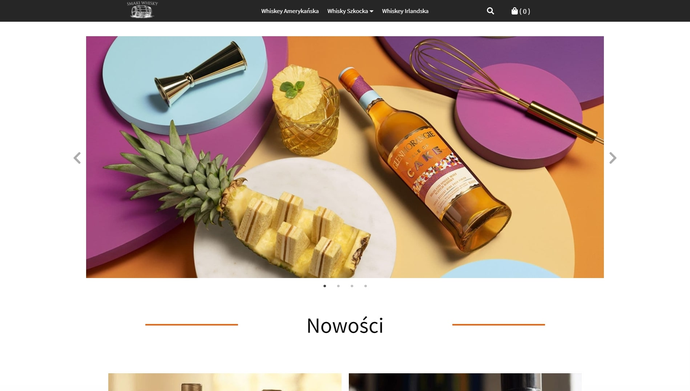
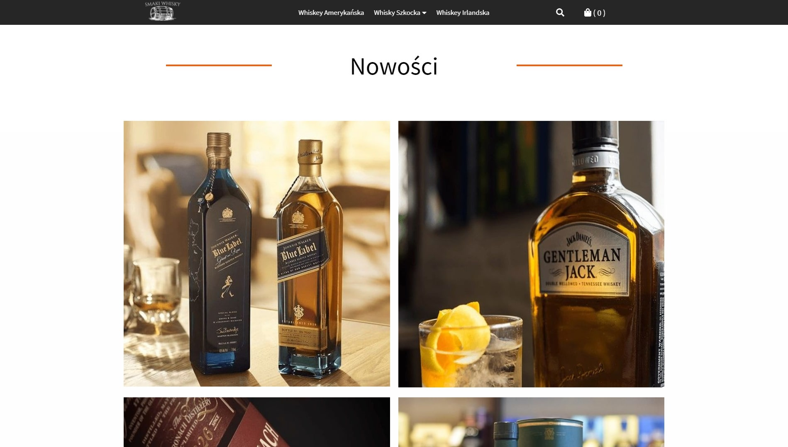
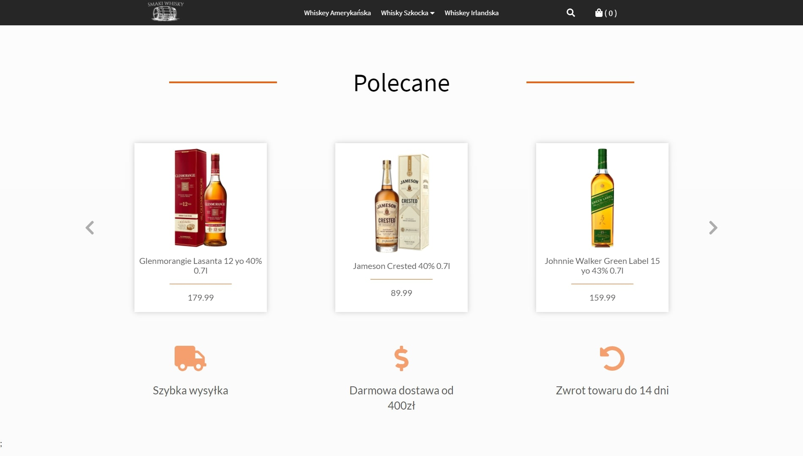
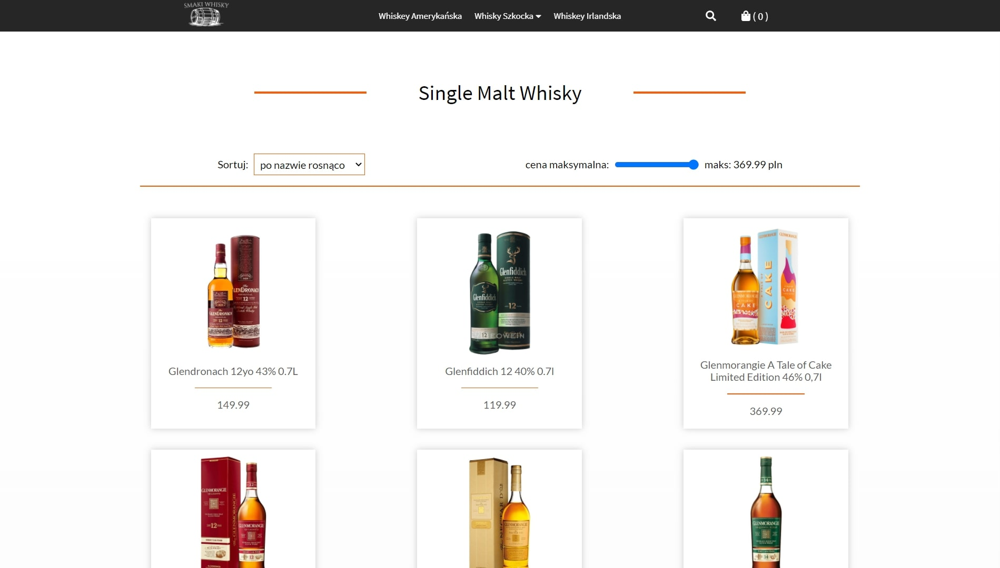
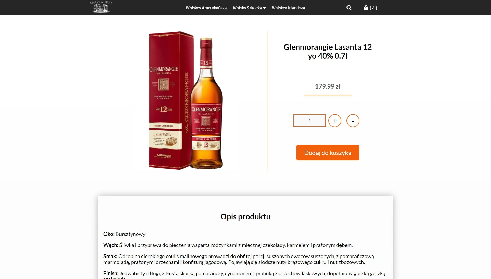
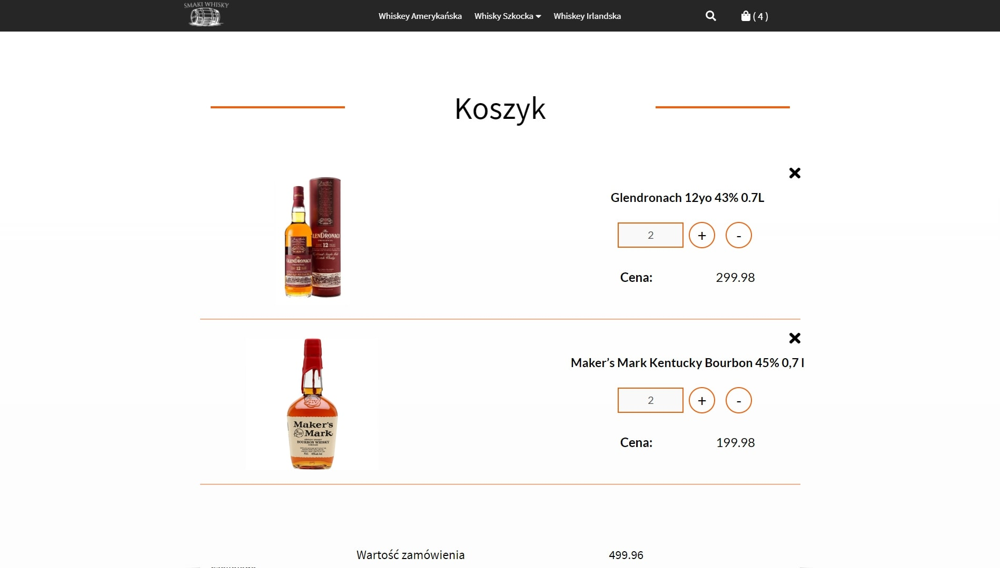
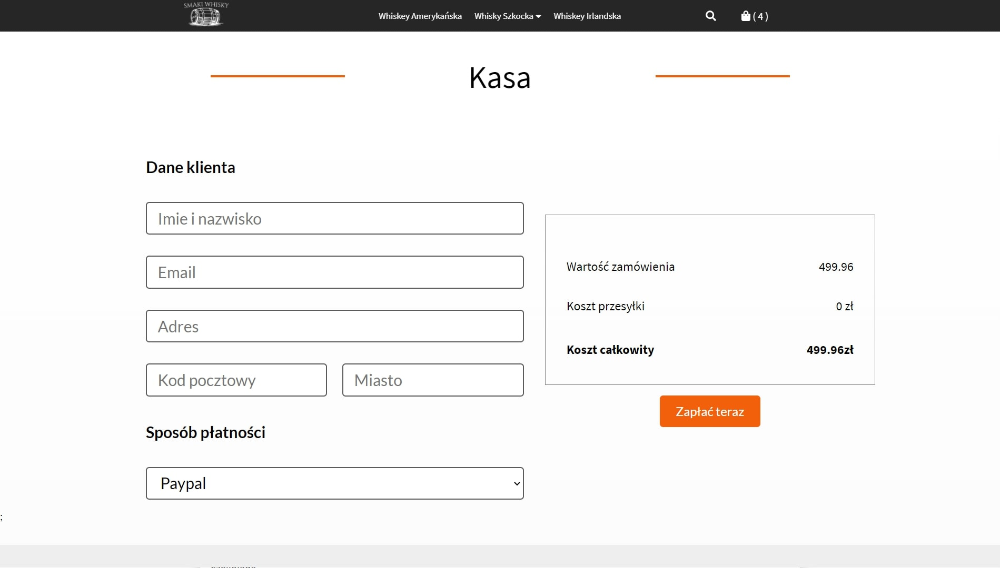

## Smaki Whisky

E-Commerce project made with TypeScript, Next.js and Strapi for self learning.

## Demo

https://smaki-whisky-2qcps7tss.vercel.app/

## Technologies

- Next.js 9.5.4
- Graphql 15.3.0
- Strapi 3.2.1
- TypeScript 4.0.3
- Formik & Yup
- Emotion 10.0.27
- Next-nprogress 1.4.0
- React-lazy-load-image-component 1.5.0
- React-modal 3.11.2
- Reflexbox 4.0.6
- React-slick 0.27.12
- React Hooks
- Local Storage

## Features

- Browsing products
- Searching products
- Adding/removing products to/from cart
- Checkout form validation with Yup
- Payment simulation
- Filtering products by price
- Sorting products by name or price

## Screenshots

